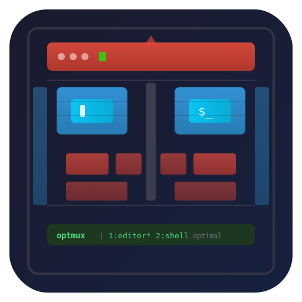

# optmux

<p align="center">
  
</p>

Optimal, opinionated, batteries-included TMUX that's neat and easy for any project.

A [tmuxp](https://github.com/tmux-python/tmuxp) wrapper that creates per-project tmux config directories with [TPM](https://github.com/tmux-plugins/tpm) and plugins pre-configured.

## Quick Start

```bash
# install optmux
uv tool install git+https://github.com/netj/optmux

# try the included example
git clone https://github.com/netj/optmux
cd optmux
./example.optmux.yaml
```

That's it. On first run, optmux will:

1. Create `.example.optmux.d/tmux/` next to the YAML file
2. Seed a default `tmux.conf` with TPM and plugins
3. Install TPM and all plugins (visible in window 0)
4. Launch tmuxp with an isolated tmux server

## Install

```bash
uv tool install git+https://github.com/netj/optmux
```

For local development/testing:

```bash
uv tool install -e .
```

## Usage

### With a tmuxp YAML file

Supports `.optmux.yaml`, `.tmuxp.yaml`, and `.optmuxp.yaml` extensions:

```bash
optmux myproject.optmux.yaml
optmux myproject.tmuxp.yaml
```

### Without arguments

```bash
optmux
```

Opens plain `tmux` using `.optmux.d/` in the current directory — useful for a quick, isolated tmux session with the bundled config.

### As a shebang

Write a [tmuxp YAML config](https://tmuxp.git-pull.com/configuration/) with the optmux shebang line and make it executable:

```yaml
#!/usr/bin/env -S uvx optmux
session_name: myproject
windows:
  - window_name: editor
    panes:
      - vim .
  - window_name: shell
    panes:
      - ""
```

```bash
chmod +x myproject.optmux.yaml
./myproject.optmux.yaml
```

## Config directory

Each project gets its own `.$NAME.optmux.d/` directory:

| Path | Purpose |
|---|---|
| `tmux/tmux.conf` | Main tmux config (editable after creation) |
| `tmux/tmux.*.conf` | Additional config files you can add |
| `tmux/tmux.sock` | Tmux server socket (isolates this project) |
| `tmux/plugins/` | TPM plugin directory |
| `tmux/plugins-update.sh` | Run manually to update all plugins |

## optmux YAML config

Add an `optmux:` section to your tmuxp YAML to configure shortcuts and tmux settings:

```yaml
optmux:
  shortcuts:
    C-M-b: gh browse .                              # Ctrl-Alt-b: run command directly
    C-M-e:
      command: ${VISUAL:-${EDITOR:-vim}} README.md  # exec directly (no shell)
      window: true                                  # open in a new-window
    E:
      send-keys: ${VISUAL:-${EDITOR:-vim}} .        # send-keys (runs in a new shell)
      zoom: false                                   # do not zoom (default: true for splits)
  tmux_config:
    project-settings: |
      set -g status-style bg=blue
```

### Shortcuts

Shortcuts bind tmux keys to commands:

- **`C-M-*` keys** are bound globally (no prefix needed)
- **Other keys** require the tmux prefix (`C-t`)
- **`command:`** executes directly (default for string values)
- **`send-keys:`** sends the command to a new shell (supports shell expansion)
- **`window: true`** opens in a new window instead of a split
- **`zoom: false`** disables auto-zoom on splits (default: true)

### tmux_config

Entries under `tmux_config:` are written as `tmux.optmux-extras.{name}.conf` files and auto-sourced by tmux.

### Personal config (`~/.optmux.yaml`)

Create `~/.optmux.yaml` to define personal defaults that apply to all optmux sessions:

```yaml
optmux:
  shortcuts:
    C-M-g: lazygit
  tmux_config:
    my-defaults: |
      set -g status-style bg=green
```

Personal config is merged with per-project config. When both define the same key, **personal settings take precedence**.

### Customization

- Edit `tmux/tmux.conf` to change tmux settings
- Drop `tmux/tmux.mysetup.conf` files for additional config (auto-sourced)
- Run `tmux/plugins-update.sh` from inside tmux to update plugins
- Press `prefix + R` to reload the config

### Environment variables

optmux sets these before launching tmux/tmuxp:

| Variable | Value |
|---|---|
| `OPTMUX_DIR` | Absolute path to the `.$NAME.optmux.d/` directory |
| `OPTMUX_NAME` | Name derived from YAML filename or cwd (e.g., `myproject`) |
| `TMUX_PLUGIN_MANAGER_PATH` | `$OPTMUX_DIR/tmux/plugins` |

## License

[MIT](LICENSE)
